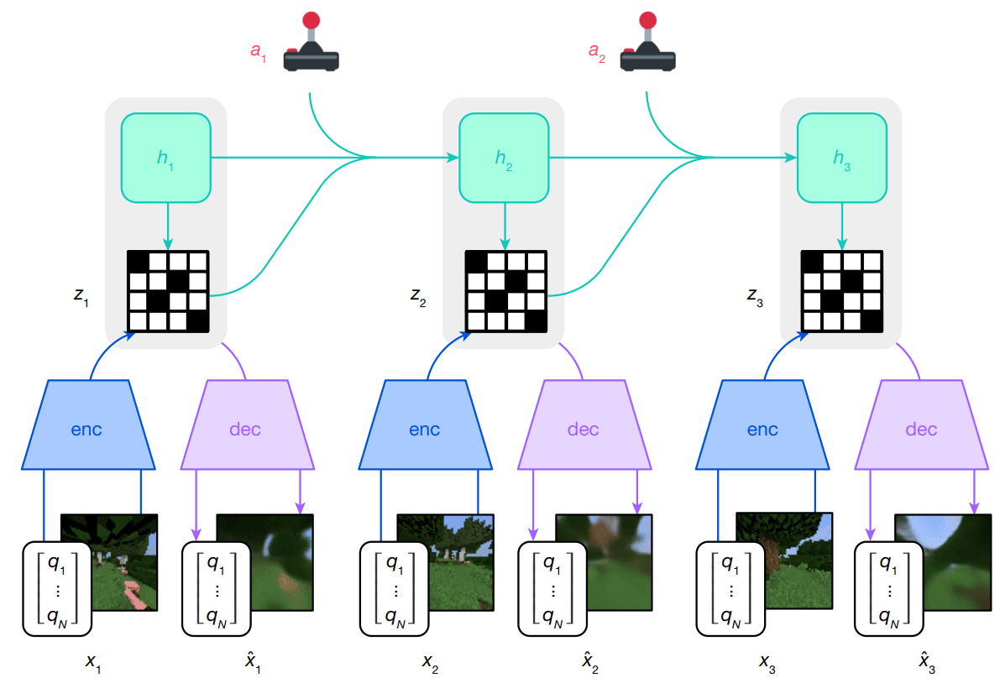

# World Models

**World models**, as their name hints, learn behaviours of the current environment they're in and generate a simulated latent space in such a way that there is no need for real observations anymore, as the model has all the tools to create estimations of what's happening in the real world (apart from actions, which come either from the real world, or from an actor-critic network that generates actions). 

## Components

- **Observation encoder**: the observations are encoded into a latent space using an encoder: $e_t = enc(o_t)$.

- **Recurrent state-space model (RSSM)**:  this model is split in two parts: the deterministic state $h_t$ and the stochastic state $z_t$ (both together are called the **model state**):
    - $h_t$ contains the long-term sequential information and compresses past information in this compact representation (GRU head). As it uses a Gated Reccurrent Unit network, its gradients stay stable over time, but are also slow to change structure.
    - If we only use $h_t$, we would only have deterministic outputs, resulting in no real estimation. Therefore, we use the stochastic state $z_t$ to encode information that cannot be encoded deterministically from the past actions (e.g. random environment events, sensory noise, ...). This allows the model to maintain a probabilistic approach to possible states. Since this results in probability distributions (stochastic process), this enables sampling for imagined rollouts, which is needed for policy learning (see Actor-Critic learning).

- **Transition model**: estimates the **prior** $p(\hat{z}_t | h_t)$

- **Inference model**: estimates the **posterior** $q(\hat{z}_t | h_t, e_t)$

## Overall training structure

Citing the [Dreamer paper](../Dreamer_paper.pdf), "The world model encodes sensory inputs $x_t$ using the encoder (enc) into discrete representations $z_t$ that are predicted by a sequence model with recurrent state $h_t$ given actions $a_t$. The inputs are reconstructed as $\hat{x}_t$ using the decoder (dec) to shape the representations. The actor and critic predict actions $a_t$ and values $v_t$ and learn from trajectories of abstract representations ̂$\hat{z}_t$ and rewards $r_t$ predicted by the world model."

In my own words, this is what it means:

1) An observation $s_i$ (can be a vector, or an image) is sent to an encoder. The output of the encoder is called the embedding, or **latent representation** of the input.
2)

## Losses

## Dreamer specificity

:::question

***How does VAE training actually work in the Dreamer case?***

:::

:::question

***What's the actual advantage of a world model? Why use this instead of something else?***

:::